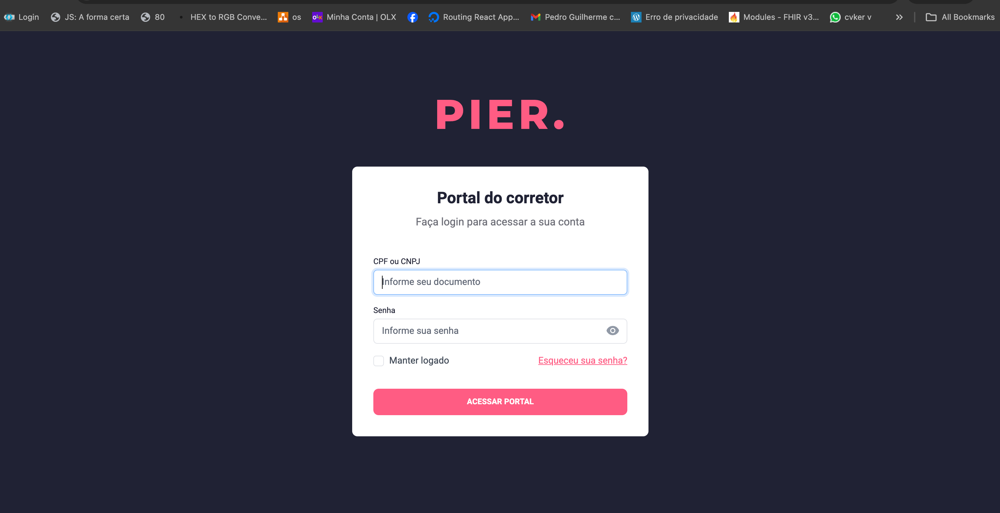
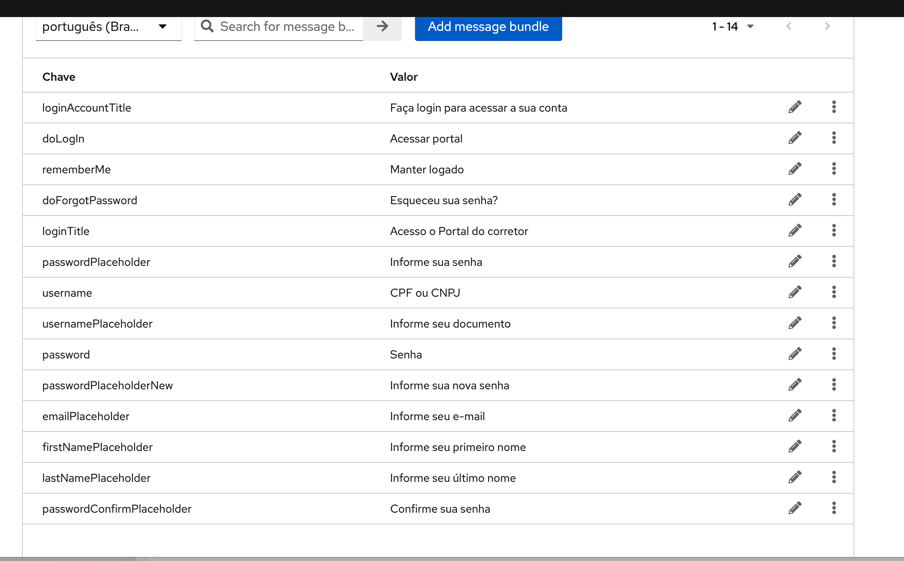

# :wind_face: Pier Keycloak Auth Theme

Tema forkado do [Keywind](https://github.com/lukin/keywind) para ser utilizado como tema de autenticação do keycloak.



## Instalação

O Keywind foi projetado com arquitetura baseada em componentes desde o início, e **você pode personalizar o Keywind o quanto precisar**:

1. [Deploy Keywind Login Theme](https://www.keycloak.org/docs/latest/server_development/#deploying-themes)
2. [Create your own Login Theme](https://www.keycloak.org/docs/latest/server_development/#creating-a-theme)
3. Specify parent theme in [theme properties](https://www.keycloak.org/docs/latest/server_development/#theme-properties):

```
parent=keywind
```

4. Marque e personalize os componentes com [FreeMarker](https://freemarker.apache.org/docs/dgui_quickstart_template.html)

## Customização

### Tema

Quando for necessário personalizar uma paleta, você poderá configurar as cores na chave `colors` na seção `theme` do arquivo de configuração do Tailwind:

`tailwind.config.js`

```js
module.exports = {
  theme: {
    extend: {
      colors: {
        primary: colors.red,
      },
    },
  },
};
```

Atualmente usamos a paleta de cores do `@pierdigital/shared-token`, configurando os botões, links, etc.

### Componentes

Você pode atualizar os componentes do Keywind em seu próprio tema filho. Por exemplo, crie uma cópia do componente `body` e altere o plano de fundo:

`theme/mytheme/login/components/atoms/body.ftl`

```
<#macro kw>
  <body class="bg-primary-100">
    <#nested>
  </body>
</#macro>
```

## Build

Quando estiver pronto para implantar seu próprio tema, execute o comando de compilação para gerar uma compilação de produção estática.

Além disso, o arquivo `.jar` necessário para ser usado no keycloak será criado na pasta `/out`.

```bash
pnpm install
pnpm build:jar
```

## Localization

O projeto está implementado para usar a localização/internacionalização do Keycloak, por conta disso, toda e qualquer criação de chave deve ser feita la e replicada aqui.

Atualmente, temos as seguintes chaves customizadas:



## Atualizar o tema no keycloak

Basicamente, é necessário dois passos:

1 - Copiar o `.jar` criado na pasta `/out` na pasta dentro do container do keycloak alvo `/opt/keycloak/providers/`.

2 - Reiniciar o container do keycloak.

3 - Selecionar o tema no realm alvo.
